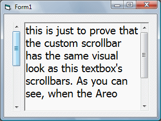

## Carles P\.V's Custom Scrollbar Control \- Updated

### Description

This is Carles P.V's great scrollbar control that I have updated to allow the "themed" property to correctly draw a themed scrollbar under Windows Vista. Also tidied up the code a lot. Don't vote for this, as this is not my code and credit goes to Carles P.V (the Steve McMahon of pscode.com, lol). Comments would be nice tho.
 
### More Info
 

             |
---                |---
**Submitted On**   |2007-09-20 02:40:02
**By**             |[Jason Newland](https://github.com/Planet-Source-Code/PSCIndex/blob/master/ByAuthor/jason-newland.md)
**Level**          |Intermediate
**User Rating**    |4.0 (16 globes from 4 users)
**Compatibility**  |VB 6\.0
**Category**       |[OLE/ COM/ DCOM/ Active\-X](https://github.com/Planet-Source-Code/PSCIndex/blob/master/ByCategory/ole-com-dcom-active-x__1-29.md)
**World**          |[Visual Basic](https://github.com/Planet-Source-Code/PSCIndex/blob/master/ByWorld/visual-basic.md)
**Archive File**   |[Carles\_P\_V2083999202007\.zip](https://github.com/Planet-Source-Code/jason-newland-carles-p-v-s-custom-scrollbar-control-updated__1-69363/archive/master.zip)

